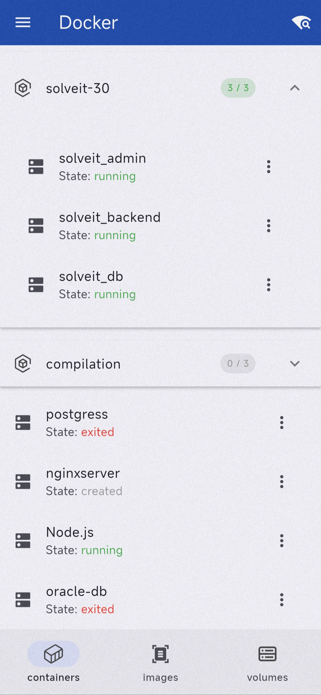
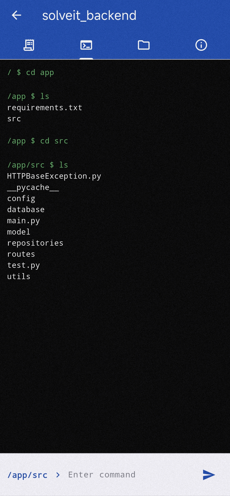
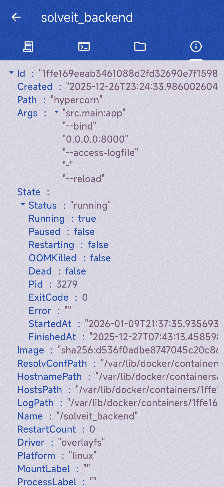
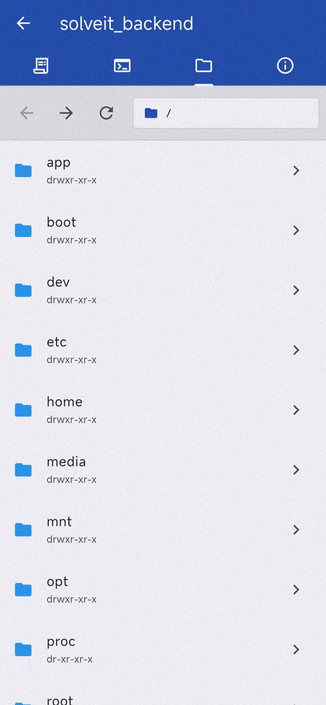
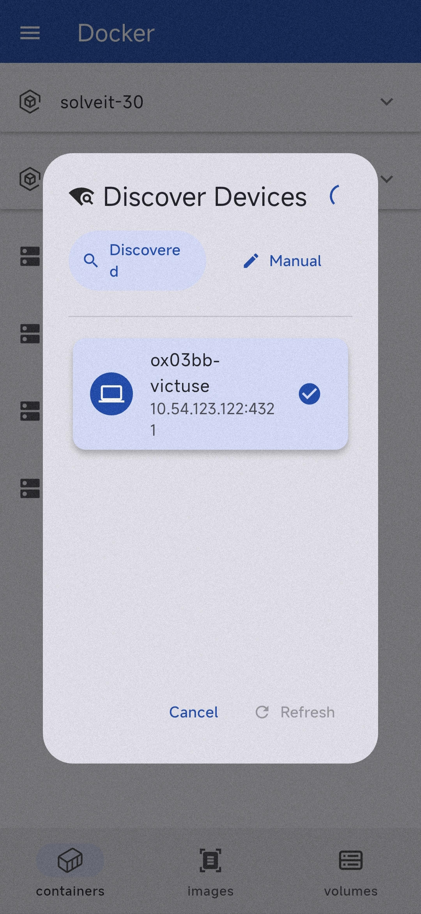
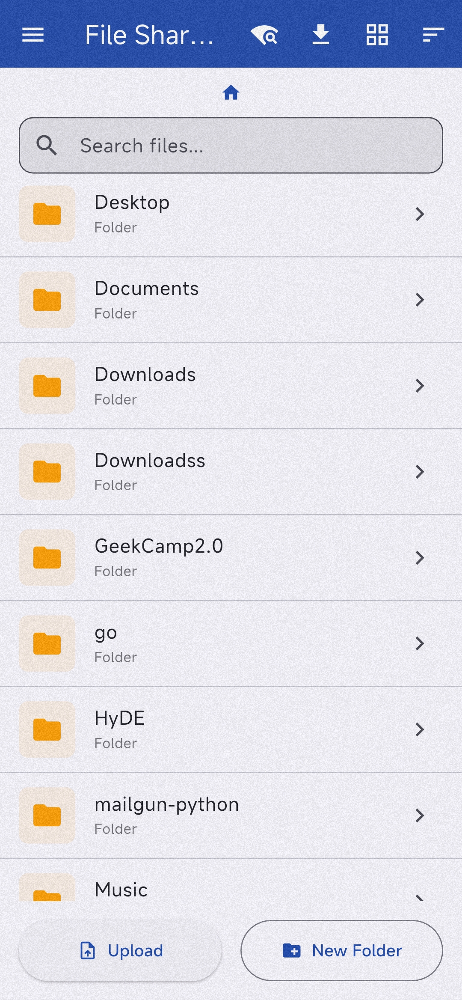
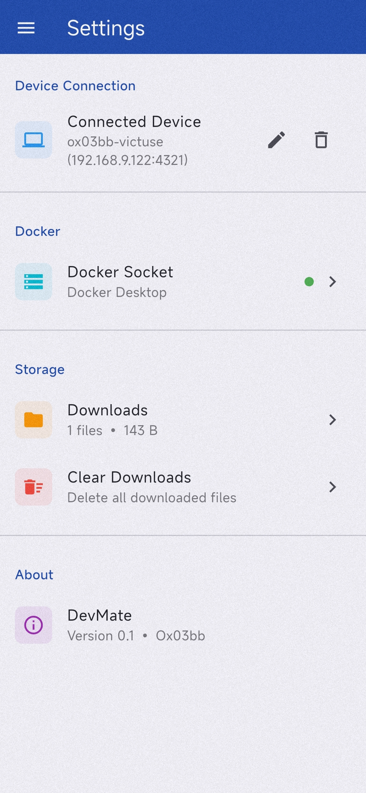

# DevMate
   


DevMate is a cross-platform mobile app for developers that enables remote management of desktop development environments. Monitor server logs, control Docker containers, run terminal commands via SSH, and transfer files – all from your phone..etc

[Features](#features) • [Screenshots](#screenshots) • [Tech Stack](#tech-stack) • [Installation](#installation) • [Usage](#usage) • [Project Structure](#project-structure) • [Contributing](#contributing) • [License](#license)

---

## Features

### Docker Management
- **Container Control** - Start, stop, restart, and remove containers
- **Volume Management** - Browse and manage Docker volumes
- **Container Logs** - View real-time container logs with search and filtering
- **Container Inspection** - View detailed container configuration and stats
- **Container Actions** - Execute commands inside running containers

### SSH Terminal
- **Full Terminal Emulation** - Connect to your development machine via SSH
- **Secure Connection** - SSH key and password authentication support
- **Persistent Sessions** - Maintain terminal sessions while navigating the app
- **ANSI Color Support** - Full terminal color rendering

### File Manager
- **Remote File Browsing** - Navigate your desktop filesystem remotely
- **File Uploads** - Upload files from your phone to your desktop
- **File Downloads** - Download files from your desktop to your phone
- **File Sharing** - Share downloaded files with other apps
- **Grid & List Views** - Toggle between view modes
- **Search & Sort** - Find files quickly with search and sorting options

### Easy Connection
- **mDNS Discovery** - Automatically discover DevMate backend on your local network
- **QR Code Pairing** - Scan QR code for instant connection setup
- **Connection Persistence** - Remember your connection settings

> [!important]
> - this app is **not secure** for use over public networks. 
> - the security part still under development.
> - Use it only on trusted local networks for now.

## Coming Soon
- **DataBase Client** - Manage databases remotely
- **Git Integration** - View and manage Local Git repositories
- **Notifications** - Get notified of important events and alerts
- **Dark Mode** - Full support for dark mode UI

## Screenshots
this some screenshots of the app in action:

| Docker Containers | Container Exec | Container Details | Container Browser |
|:-----------------:|:-----------------:|:--------------:|:--------:|
|  |  |  |  |

| Descovary | File Manager | Settings |
|:--------------:|:------------:|:------------:|
|  |  |  |
## Tech Stack

- **Dart** SDK ^3.10.4
- **Flutter** 3.38.5 with Material Design 3
- **Go** 1.25.5

## Installation

### Mobile App

```bash
# Clone the repository
git clone https://github.com/yourusername/devmate.git
cd devmate

# Install Flutter dependencies
flutter pub get

# Run on connected device
flutter run
```

### Backend

```bash
# Navigate to backend directory
cd backend

# Install Go dependencies
go mod download

# Build the backend
go build -o devmate-backend ./cmd/main.go

# Run the backend
./devmate-backend
```

## Usage

### 1. Start the Backend

On your development machine, run the DevMate backend:

```bash
cd backend
go run ./cmd/main.go
```

The backend will:
- Detect your local IP address
- Start an mDNS broadcaster on `_devmate._tcp`
- Display a QR code in the terminal for easy connection
- Connect to the Docker socket for container management
- Start the file server for remote file management

### 2. Connect from Mobile App

**Option A: QR Code (Recommended)**
1. Open DevMate on your phone
2. Go to Settings
3. Tap "Scan QR Code"
4. Scan the QR code displayed in your terminal

**Option B: mDNS Discovery**
1. Open DevMate on your phone
2. Go to Settings
3. Tap "Discover Devices"
4. Select your development machine from the list

**Option C: Manual Connection**
1. Open DevMate on your phone
2. Go to Settings
3. Enter your machine's IP address and port manually

### 3. Start Managing

Once connected, you can:
- **Docker Tab**: View and manage containers, images, and volumes
- **Terminal Tab**: Open SSH sessions to run commands
- **Files Tab**: Browse, upload, and download files


## Project Structure

```
devmate/
├── lib/                      # Flutter app source
│   ├── main.dart             # App entry point
│   ├── config.dart           # App configuration
│   ├── docker/               # Docker management module
│   │   ├── models/           # Data models
│   │   ├── screens/          # UI screens
│   │   ├── services/         # API services
│   │   └── widgets/          # Reusable widgets
│   ├── terminal/             # SSH terminal module
│   │   ├── ...
│   ├── files/                # File manager module
│   │   ├── ...
│   └── shared/               # Shared components
│       ├── ...
├── backend/                  # Go backend source
│   ├── cmd/                  # Entry point
│   ├── internal/             # Internal packages
│   │   ├── cli/              # CLI interface
│   │   ├── config/           # Configuration
│   │   ├── fileserver/       # File server
│   │   ├── mDNS/             # mDNS broadcaster
│   │   ├── proxy/            # Reverse proxy
│   │   └── qrcode/           # QR code generator
│   └── pkg/                  # Public packages
├── android/                  # Android platform files
├── ios/                      # iOS platform files
├── linux/                    # Linux platform files
├── macos/                    # macOS platform files
├── windows/                  # Windows platform files
└── web/                      # Web platform files
```

## Contributing
i will be happy to accept any contributions. Please open issues and submit pull requests for bug fixes and new features.


## License

This project is licensed under the GNU General Public License v3.0 - see the [LICENSE](LICENSE) file for details.


By: Ox03BB